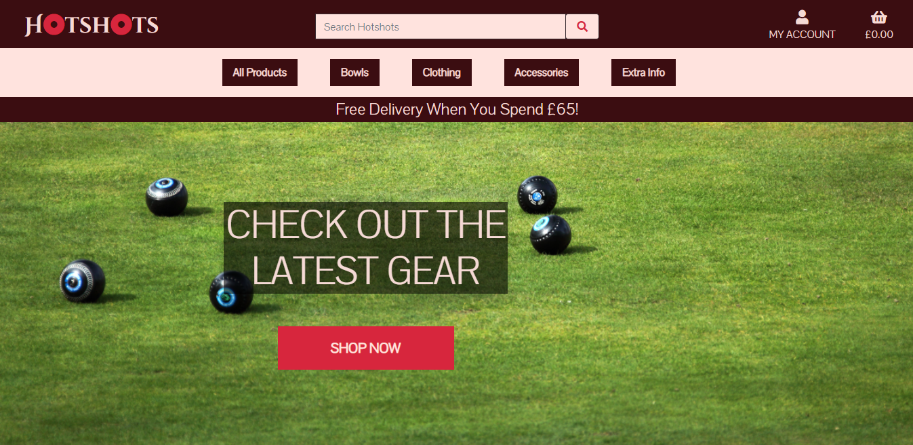
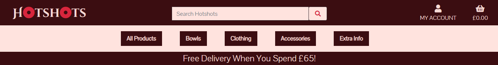
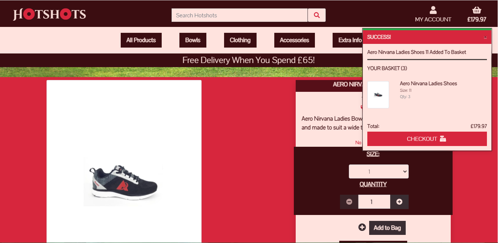
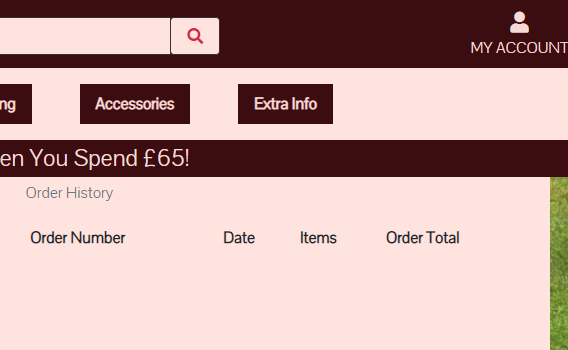
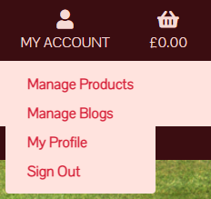

# Hotshots

####  A link to the live site is here: [Hotshots](https://hotshots.herokuapp.com/) 

 **This is a e-commerce type website enabling people to shop online for lawn bowls equipment.** 
 **Users are able to add, edit and update their basket and pay for products**

## User Experience (UX) User stories

### As a user I want to ...
- Be able to navigate the site easily

- Be able to search for items on the site 

- Be able to control and amend products I choose

- Be able to view past orders 

- Be able to register an account

- Be able to read extra content that may help inform my purchasing

- Be able to express my views about a product whether positive or negative to inform other users.

## Design 

### **Colour Scheme** 
The colour scheme for this site was developed with assitancefrom the following site [coolors](https://coolors.co/).
Starting off with Crimson (#D7263D) other complementary colours were suggested using the Cooloers generator, which aided the developer to settle on the following colours completing the scheme Misty Rose(#FFE3DC), Baby Pink(#DBB4AD), Dark Sienna(3B0D11), Black Coffee(#3A2D32) and Dark Liver(#4C4045). The most prodominent throughout the site colours are Crimson, Dark Sienna and Baby Pink.

### **Typography** 
Two font styles were used on the site, courtesy of Google Fonts, the most predominant style was Pontano Sans with the fallback of sans-serif. The developer felt that this font style gave a clean and modern to the site. The Navbar brand has another style Cinzel Deorative with the fallback of cursive. This font was chosen as it appeals to the eye as a standout font, as well as having a stylish, modern look.

### **Imagery** 
As a Bowls e-commerce store the developer felt it was important for there to be a consistent reminder of that throughout the site so starting from the landing page the user is welcomed by the image of a bowls green with some bowls by a jack. This image remains in the background and can been seen it parts through the site. 

### **Wireframes** 

1. Desktop

2. Tablet

3. Mobile

### **Models**

### **Features**
- Responsive on most devices sizes
- Interactive elements

> ## Technologies Used 

### **Languages Used** 
HTML5 
CSS3
JavaScript3
Python3

### **Frameworks, Libraries & Programs Used** 

- Bootstrap 4: Bootstrap was used to assist with the responsiveness and styling of the website. Specific features include - navbars, burger menu, collapsible. 
 
- Google Fonts: Google fonts was used to import the two fonts on the site into the style.css file. 

- Font Awesome: Font Awesome was used on buttons to add icons for aesthetic and UX purposes. 

- jQuery: jQuery is required for Bootstrap to make the navbar responsive, along with the other features taken from Boostrap. 
 
- Git: Git was used for version control by utilizing the Gitpod terminal to commit to Git and Push to GitHub. 

- GitHub: GitHub is used to store the projects code after being pushed from Git. 

- Balsamiq: Balsamiq was used to produce wireframes during the design process.

- Heroku: Heroku was use as the platform to deploy the app.

- Django: Django was used to store the production database of the created apps.

- Jinja: Jinja templating was used extensively throughout the site.

> ## Testing 
The W3C Markup Validator and W3C CSS Validator Services were used to validate every page of the project to ensure there were no syntax errors in the project.

### **W3C Markup Validator**

    The Markup Validator highlighted 2 errors. 1 related to href attribute on h4, this was to apply Jinja on the brand logo so when 
    clicked it took the user to the home page, however the developer has now removed this href. the other error relates to a div being a child of a ul.
    The div was placed as such to enable the hero image to load onto the side nav, without it the sidebar was solid black. The developer has decided to
    remove the image, despite it adding a professional touch. 

### **W3C CSS Validator**  

	The result of the CSS validator highlighted 3 errors. One error is part of Materialize's CDN. The other Two relate to the rainbow 

### **Lighthouse** 

> ## Testing User Stories from User Experience (UX) Section

##  *User Goals*  
- ## Be able to navigate the site easily

Users are able to efficiently navigate the site via the navbar on at the top of the site. All of the option present on the image above have a drop down menu for the User to narrow down their navigation. The basket preview has a checkout button for convinience and all buttons are well lablled. 

- ## Be able to search for items on the site 

Users are able to search in the searchbar picture, using keywords and it will run a search that looks for matches in both the product name and product description, which allows the user to look at products tailored to thier needs.

- ## Be able to control and amend products I choose

Users can control and amend in various places. For non-registered Users they are able to add, remove and modify quantity of their shopping basket. For registered user they can also add reviews about each product if they wish, and edit their information via their profile page. Users with superuser access, can do all the aforementioned action, but additionally can edit and delete reviews and blogs, as well as create blogs for features.  

- ## Be able to view past orders 

In a registered User's profile are the past orders they aquired. Clicking on these will give the User the order detail information.

- ## Be able to register an account

From clicking on the account tab in the top right of the screen a dropdown menu will give Users the option to Create Account. From this link they are taken to a form to fill out their details and upon confirming registration are taken to their new profile page.

- ## Be able to read extra content that may help inform my purchasing

From the navbar Users have the option to choose "Extra Info" from the menu options, this will give the further option of blogs ...

In the Blogs section Users can find features to aid in their purchasing decisions.

- ## Be able to express my views about a product whether positive or negative to inform other users.

Registered Users can write reviews about products on the site in the product detail pages. All Users are able to view them, with only those with administrative powers able to delete.

## **Further Testing** 
- The Website was tested on Google Chrome, Opera, Microsoft Edge and Safari browsers. 
- The website was viewed on a variety of devices such as Desktop, Laptop, iPad Air & iPhoneX. Other devices were tested through the inspect web developer tools.

##  **Known Bugs/Issues** 
- Reviews rating system: In implementing a dropdown box via models for adding and editing product reviews it appears that this has caused the rating to not appear on the front end under the review instead reverting to "No Rating" as per the templating. This is a front end issue which the developer was unable to find a resoultion to, however in the admin panel it is clear that the form data is capturing the review rating.

> ## Deployment 

### **Heroku**  
The project was deployed to Heroku using the following steps...

1. Before you can deploy your app to Heroku, you need to initialize a local Git repository and commit your application code to it.
2. The heroku create CLI command creates a new empty application on Heroku, along with an associated empty Git repository. If you run this command from your app’s root directory, the empty Heroku Git repository is automatically set as a remote for your local repository.
3. You can use the git remote command to confirm that a remote named heroku has been set for your app
4. To deploy your app to Heroku, you typically use the git push command to push the code from your local repository’s master or main branch to your heroku remote
5. Use this same command whenever you want to deploy the latest committed version of your code to Heroku.
6. Note that Heroku only deploys code that you push to master or main. Pushing code to another branch of the heroku remote has no effect. 

### **Forking the GitHub Repository** 
By forking the GitHub Repository we make a copy of the original repository on our GitHub account to view and/or make changes without affecting the original repository by using the following steps...

1. Log in to GitHub and locate the GitHub Repository 
2. At the top of the Repository (not top of page) just above the "Settings" Button on the menu, locate the "Fork" Button.
3. You should now have a copy of the original repository in your GitHub account.

### **Making a Local Clone**  
1. Log in to GitHub and locate the GitHub Repository Under the repository name, click "Clone or download". 
2. To clone the repository using HTTPS, under "Clone with HTTPS", copy the link. 
3. Open Git Bash Change the current working directory to the location where you want the cloned directory to be made. 
4. Type git clone, and then paste the URL you copied in Step 3. $ git clone https://github.com//TJones305/Hotshots Press Enter. 
5. Your local clone will be created. $ git clone https://github.com//TJones305/Hotshots

> ### *Credits*  

- Bootstrap: Bootstrap Library used throughout the project to make site responsive using the Bootstrap Grid System and implementing the navbar.

- MDN Web Docs: For Pattern Validation code.

- Google Fonts: For use of their brilliant Fonts

- Font Awesome: For use of their icons.

- Content: All content was written by the developer.

> ## Acknowledgements 
- My Mentor Gerry McBride for constructive feedback and continuous support.

- Student support at Code Institute for their advice and guidance throughout the project.